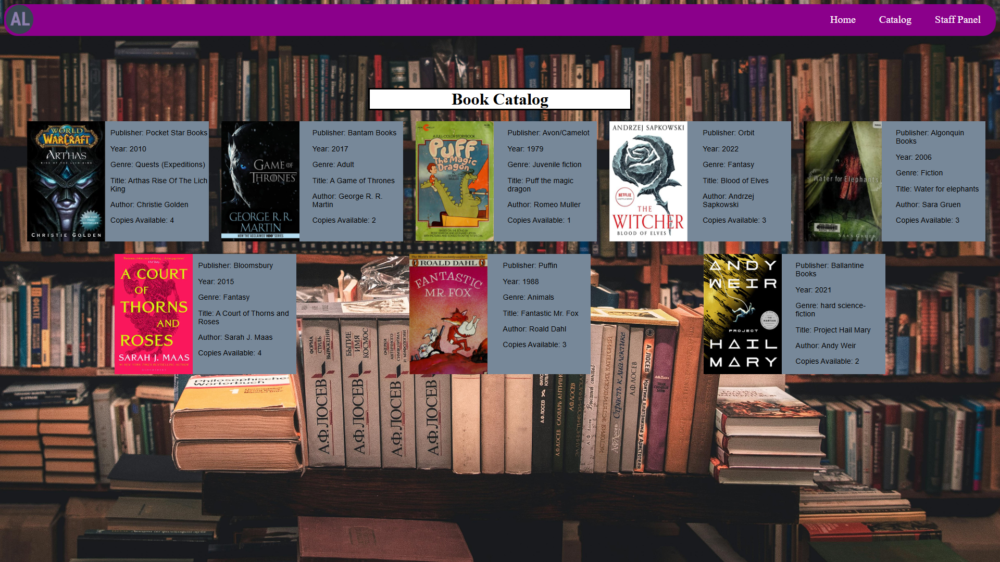

# Azeroth Library

<p> 
    
    
    
</p>


## Table of Contents
1. [Description](#description)
2. [Screenshots](#screenshots)
3. [Live Website](#live-website)
4. [Installation](#installation)
5. [License](#license)

## Description

This project is a library website with a fully working backend database using Oracle. Admins for the site are able to add books, add members, checkout books, and return them. Users are able to view the books they have checked out to them.
## Live Website
Please view the live application [here](/)

## Screenshots




## Installation
To clone the repo:
```
git clone https://github.com/JustinSnyder611/Azeroth-Library
``` 
Run 'npm install' to install dependencies

Change database settings in server.js to your local oracle database.

Run 'npm start' to start the backend

## License
[](https://opensource.org/licenses/MIT) 
